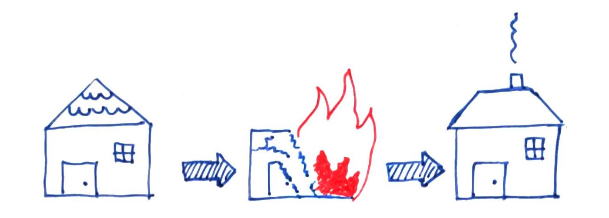
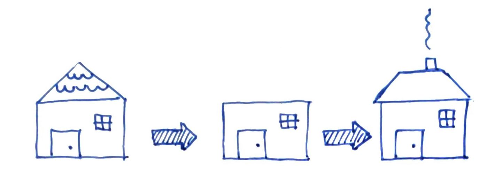
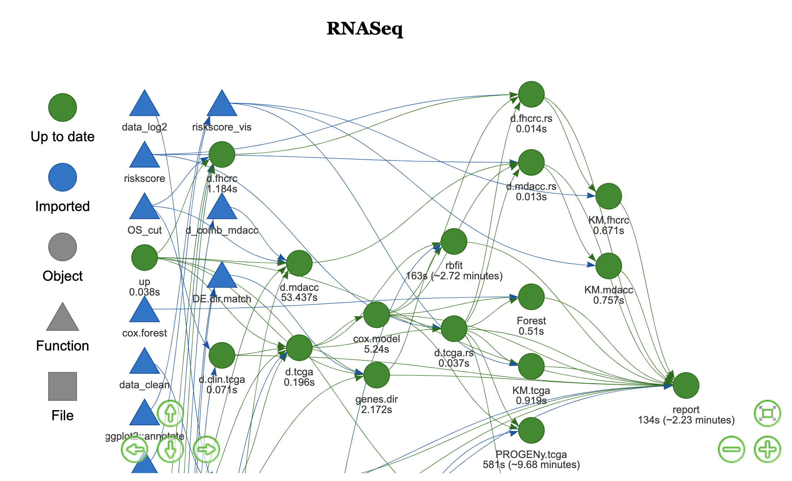
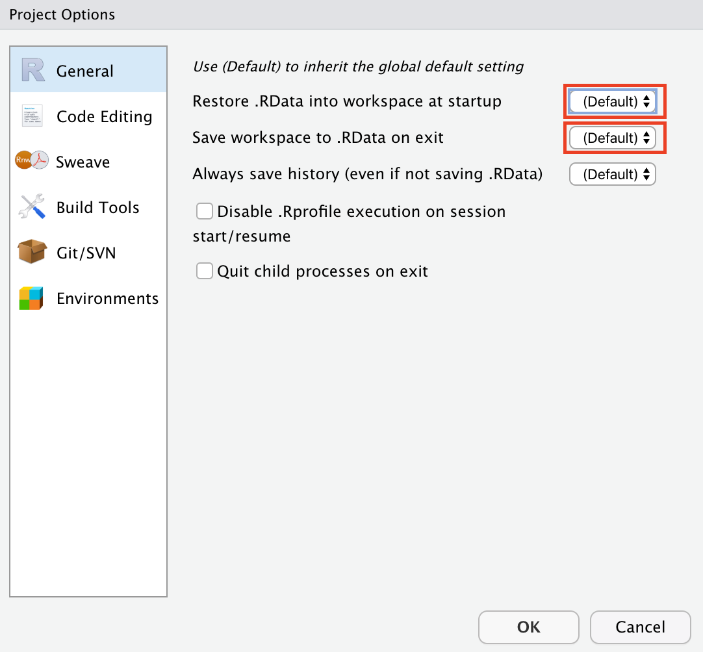

## Idea

To explain the reason for this blog post, I want to use an analogy. Let's think of data analysis as we would be building a house. Ideally, you design your blueprint and then build the house of your dreams. But in nearly 100 % of the cases, this will not happen. Most likely, there will be a rough idea and a draft rather than a true well structured workflow. You will build your house, then look at it and finally decide you want a different roof. Because you are in the process, your (R-)environment looks quite messy and you are not certain of all your intermediate steps. Thus, you decide to rebuild everything from scratch and, at the last step, replace the roof with the new one.

If your blueprint (analysis) is quite complex, your machine might take a while to rebuild your house. This cannot only be time consuming but also confusing and frustrating. 

So instead of burning down everything, why not just remove the old roof and add a new one on top? This would make things a lot easier to follow up and much faster to get to your final results.

[Will Landau](https://github.com/wlandau?tab=repositories) wrote an R package called [Drake](https://books.ropensci.org/drake/) to do exactly that and much more. Recently, I started using Drake and I do not want to miss it anymore. Even though, Drake means adding yet another layer of complexity to your code, the benefits are justifying the addition of complexity. 

With this post, I want to give a brief look at my personal highlights of Drake. For sure, I am still only scratching the surface of this powerful package.

## What is Drake?

Will Landau and colleagues came up with a nice introduction and even a talk about Drake. Click [here](https://books.ropensci.org/drake/) for more info.

Essentially, Drake is a package organizing and streamlining your workflow for you. It realizes which part of your analysis was changed and recalculates only this part and downstream dependencies. 

## Why using Drake?

Well, all good things come in threes. So, here I will list my main three reasons why I think you should use Drake.

### 1- Functions, functions and functions

The first few steps with Drake might be a little rough, especially if you are not an R-expert yet. But this is already a good argument for using Drake; especially in the beginning when coding, you will probably code your calculations, then copy-paste, and slightly readjust the same calculation for a different data set. Often, this will lead to bloated R-scripts and a messy workspace, making it hard to keep track of the workflow. 
Drake wants one R-script containing all your data munging steps as functions. This forces you to really think in a generalized manner and avoids essentially repetitive code chunks.

### 2- Dependency graph

And here comes the next synergistic feature; since all your data munging will be structured in one R-script, Drake needs you to write a plan about when and where to apply your functions. This plan can be visualized as an interactive dependency graph. In the default HTML-output file, you may reshuffle your objects and functions. Drake even tells you the time spent for calculation. I use this dependency graph to examine and explain my workflow to colleagues and superiors. Here, I posted a static workflow example of an analysis on RNASeq data I am currently doing. If you are actually creating your own dependency graph with `vis_drake_graph()` it will be an interactive HTML-file. 

### 3- Time saver

Within the dependency graph, outdated items are marked. Drake understands which steps have been outdated, deleted or are missing for whatever reason. As you may see in the dependency graph, parts of my workflow take minutes. So, running outdated steps only can be a massive time saver! What Drake does is that it creates a hidden cache and up-to-date items will simply recalled from there. A good thing is that you may access your cache at any time by using the `readd()` or `loadd()` commands to look at an object of your workflow. With the command `r_drake_build(target = "XYZ")` you can further build specific target objects exclusively. This makes you independent of the workspace restoring of R-Studio. In fact, when using Drake I would recommend to turn off the default mode of R-Studio in your project options.

## Further links

Hopefully, the listed benefits of Drake are convincing enough to you to try it out. In the beginning, it may take a short while to adjust to the concepts of Drake, especially when you are sort of new to R and [R-Studio](https://rstudio.com/). But it is definitely worth the initial extra effort!

Besides the already mentioned [manual](https://books.ropensci.org/drake/visuals.html#underlying-graph-data-node-and-edge-data-frames), a [learndrake short course](https://github.com/wlandau/learndrake/blob/master/README.md) has been added to the package. Further, Miles McBain wrote a [blog article](https://milesmcbain.xyz/the-drake-post/) about Drake and Eric Nantz, the host of the R-podcast, uploaded an [episode](https://r-podcast.org/episode/022-diving-in-to-drake-with-will-landau/) with Will Landau covering Drake.